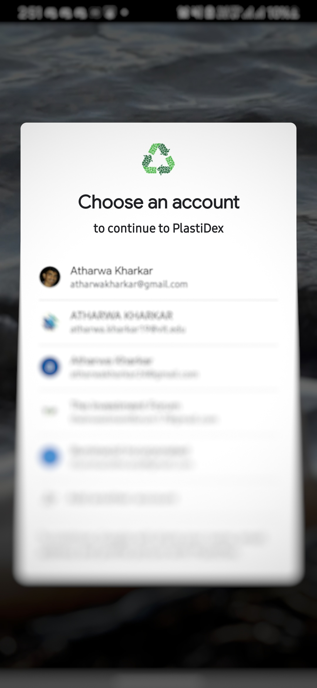
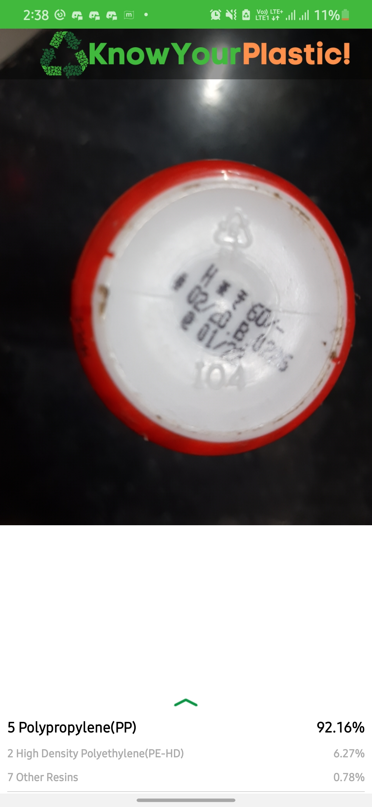
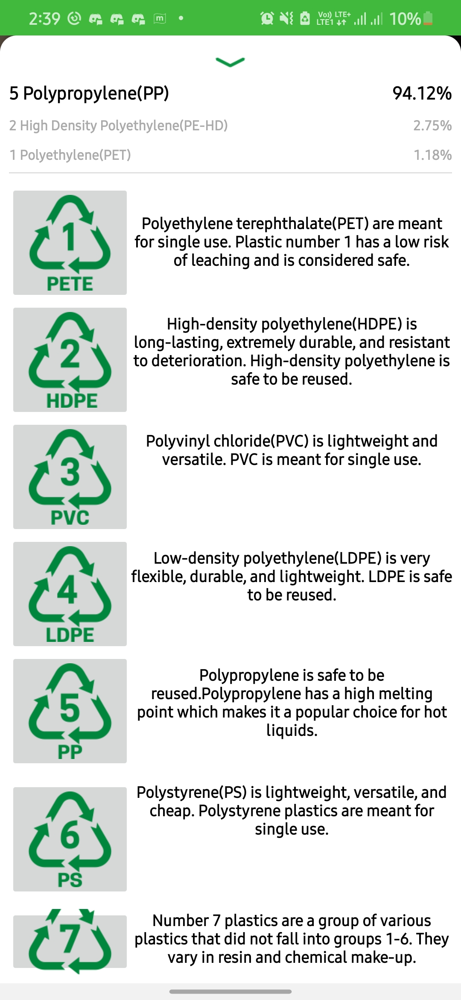

<h1 align="center">PlastiDex</h1>

## Inspiration

Almost 45% of the total plastic packaging get thrown or dumped into the Oceans,
so we Decided to come up with the idea of making an Ecosystem so that we can
classify the type of plastic and to create awareness regarding it and how to
Recycle the Plastic waste. Our project aims to create a better understanding
among people about which exact plastic are they using and to help them identify
a way to dispose it in a eco-friendly manner. This will help in keeping our
Communities and our Planet **Green & Clean**.

## Screenshots

|  |  |  |
| -------------------------------------- | ---------------------------------------------- | ---------------------------------------- |

|  |  |  |
| --------------------------------------- | ---------------------------------------------- | ---------------------------------------- |

## Overview

An efficient tool that uses convolutional neural networks in order to detect the
code on plastic materials and gives further information on how to dispose, hoe
many times to use and what must be avoided.

## Summary

This project mainly aims to promote recycling. It helps people understand their
plastic and dispose it effectively and in a eco-friendly manner.

## Conclusion

With the amount of misinformation spreading and the climate clock ticking, it is
our responsibility to inform people and to protect our environment. This project
will help people in understanding what is necessary. It will create a certain
awareness amongst people and can be further turned into a competition of sorts
with a leaderboard, promoting recycling in a fun way. Till the day we are
completely plastic free, we can at least recycle and responsibly dispose off the
ones we do not need.

## Challenges we faced

- We didn't have a large enough dataset and to overcome it we had to expand it
  using it using our household items.
- Integrating the tensorflowlite model into our android app was very tricky
  because we used it for the first time.
- Creating the ML model, the App, and the webpage in limited time was very
  challenging.

## Accomplishments we are Proud of

- Creating a tesnorflowlite model for the first time.
- Integrating the ML model, the app and the website.
- Creating a project which is very helpful to the community.
- Using **Google Cloud Platform, O-Auth 2.0** for the first time.

## Future scope

- Expanding our dataset by taking samples from the users.
- Implementing a leaderboard system so users can compete with each other and
  recycle more plastic.
- Making the website more interactive.

## Contributors :sparkles:

<table>
<tr>
    <td align="center">
        <a href="https://github.com/atharwa-24">
            
             
            <b>Atharwa_24</b>
        </a>
    </td>
    <td align="center">
        <a href="https://github.com/omkhairate">
            
             
            <b>Om Khairate</b>
        </a>
    </td>
    <td align="center">
        <a href="https://github.com/DhawalKhapre">
            
             
            <b>Dhawal Khapre</b>
        </a>
    </td>
    <td align="center">
        <a href="https://github.com/tejas2806">
            
             
            <b>Tejas Khairnar</b>
        </a>
    </td>
    </tr>
</table>
